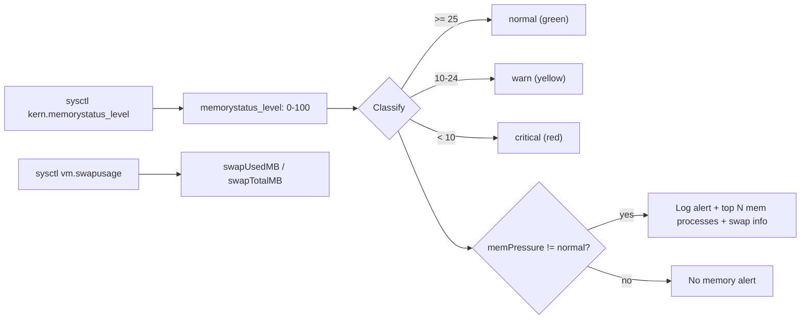

# Design Log #1 — Memory Pressure Alerting

## Background

The watchdog monitors CPU and memory, logging alerts when thresholds are exceeded. Memory alerting was initially based on system-wide RAM usage percentage (`os.freemem()`), which is meaningless on macOS — the OS intentionally uses ~100% of RAM for file cache and compressed memory. A 99% "used" reading is perfectly healthy.

Activity Monitor solves this with **Memory Pressure** — a green/yellow/red gauge that reflects whether the system is actually struggling, not just how full the RAM is.

## Problem

Current memory alerts fire constantly (every 30s sample) because macOS always reports near-100% usage. This makes memory alerts useless noise — they never distinguish "normal macOS behavior" from "your Mac is actually thrashing."

## Questions and Answers

**Q1: What macOS APIs/commands expose memory pressure?**

A1: Three sources available without root:
- `sysctl kern.memorystatus_level` — integer 0-100, higher = more available. Maps to Activity Monitor colors.
- `sysctl vm.swapusage` — current swap total/used/free in MB.
- `vm_stat` — cumulative page-level stats (swapins, swapouts, compressions). Can diff between samples for rate.

**Q2: What are the exact thresholds for green/yellow/red?**

A2: Apple doesn't publish exact numbers. Observed behavior on multiple machines:
- Green (normal): `kern.memorystatus_level` >= ~30
- Yellow (warn): ~15–30
- Red (critical): below ~15

These are approximate. We'll use 25 and 10 as boundaries, which are conservative and avoid false positives.

**Q3: Should we alert on swap existence or only swap activity?**

A3: Some swap usage is normal on macOS — the compressor may push cold pages to swap even under green pressure. Alert should trigger on **memory pressure level** (not green), with swap usage included as context in the log entry. This way a small amount of idle swap won't spam alerts, but when the system is actually struggling (yellow/red), we log swap details alongside top processes.

**Q4: Is `kern.memorystatus_level` lightweight to poll every 30s?**

A4: Yes. `sysctl` is a single syscall, no process spawning overhead beyond `execFile`. Combined with `vm.swapusage` in one call, it adds negligible cost.

## Design

### Memory pressure model



### New types in `src/sampler.ts`

```typescript
export type MemoryPressure = "normal" | "warn" | "critical";

export interface MemoryInfo {
  pressure: MemoryPressure;
  pressureLevel: number;    // raw kern.memorystatus_level (0-100)
  swapUsedMB: number;
  swapTotalMB: number;
  freeMemMB: number;        // kept for informational display
  totalMemMB: number;       // kept for informational display
}
```

`SystemSnapshot` replaces `usedMemPct` with the `MemoryInfo` fields.

### New config in `src/config.ts`

```typescript
/** Minimum memory pressure level to trigger alerts */
memPressureAlert: "warn" | "critical";  // default: "warn"
```

Replaces the old `memThreshold: number`.

- `"warn"` (default) — alert on yellow + red
- `"critical"` — alert only on red

### Alert logic in `src/monitor.ts`

```typescript
// ❌ Old: always fires on macOS
if (snapshot.usedMemPct >= config.memThreshold) { ... }

// ✅ New: only fires when macOS is actually struggling
const pressureRank = { normal: 0, warn: 1, critical: 2 };
const thresholdRank = pressureRank[config.memPressureAlert];
const currentRank = pressureRank[snapshot.memory.pressure];

if (currentRank >= thresholdRank) {
  // log alert with: pressure level, swap usage, top N mem processes
}
```

Alert log level maps to pressure: `"warn"` log level for yellow, `"alert"` for red.

### CLI in `src/cli.ts`

```
--mem-pressure <level>   Memory pressure to alert on: warn or critical (default: warn)
```

### Report changes in `src/reporter.ts`

Overview table replaces "Avg/Peak memory used %" with:
- Memory pressure alerts (warn count, critical count)
- Peak swap usage (MB)

Top Memory Offenders table unchanged — still shows processes ranked by mem% during non-green pressure.

## Implementation Plan

1. `src/sampler.ts` — add `getMemoryPressure()`, update `SystemSnapshot`, keep `getProcessList()` unchanged
2. `src/config.ts` — replace `memThreshold` with `memPressureAlert`
3. `src/monitor.ts` — rewrite memory alert condition, update log messages
4. `src/cli.ts` — replace `--mem-threshold` flag with `--mem-pressure`
5. `src/reporter.ts` — update overview table and memory stats
6. `README.md` — document new behavior

## Trade-offs

| Decision | Pro | Con |
|----------|-----|-----|
| Use `kern.memorystatus_level` over raw % | Matches Activity Monitor, no false positives | Thresholds are approximate (Apple undocumented) |
| Default alert on `warn` (yellow) | Catches issues before they get critical | May fire during transient spikes (e.g., large compile) |
| Keep `freeMemMB`/`totalMemMB` in snapshots | Useful context in reports | Slightly redundant with pressure level |
| Shell out to `sysctl` vs native bindings | Zero dependencies, simple | One extra process spawn per sample (~2ms) |
| Fixed thresholds (25/10) vs configurable | Simple, matches common observations | Won't adapt to unusual hardware configs |

## Implementation Results

Implemented as designed. All 6 files updated, compiles clean, smoke-tested.

### Test results

- Started with `--interval 3`, system at pressure level 38 (green) with ~12GB swap
- CPU alerts fired correctly for processes above threshold
- **No false memory alerts** — the old code would have fired every single sample (99.9% used), new code stayed silent because pressure is green
- Report correctly shows 0 memory pressure warnings, includes swap and pressure level stats

### Deviations from design

- **`os.freemem()` kept**: design said to remove `getMemoryInfo()` entirely. Kept `os.freemem()`/`os.totalmem()` as informational fields in `MemoryInfo` since they're useful context in reports and cost nothing.
- **`MemoryInfo` nested in snapshot**: instead of flattening pressure fields into `SystemSnapshot`, grouped them under a `memory: MemoryInfo` object for cleaner structure.
- **Reporter handles both `"warn"` and `"alert"` log levels**: memory warnings use log level `"warn"`, critical uses `"alert"`. The old reporter only checked `level === "alert"`, updated to check both.
